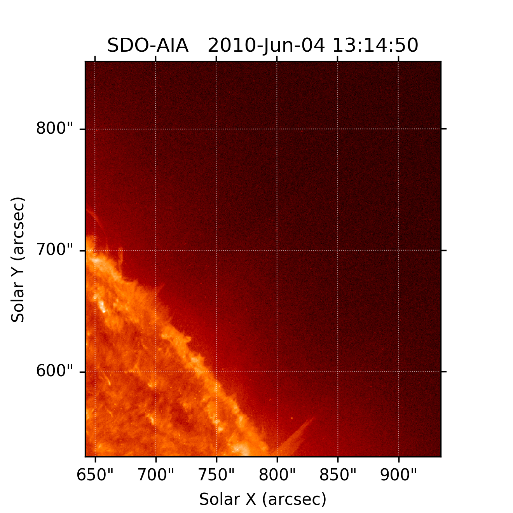

# Zooniverse Processor 

This is a package to aid in the construction of the JETS universe database. The primary sequence of operations envisioned for this package 

1. Download HEK Events (`solar.service.hek`)
2. Store these events in a database 
3. Use the cutout service to pull these events (`solar.service.cutout`)
4. Store job information in database 
5. Download appropriate fits files based on this data
6. Convert fits files into movies and pngs for use in zooniverse (`solar.visual`)
7. Map image coordinates to world coordinates

# Package Contents
## Request events from HEK
```python
from solar.service.hek import Hek_Service
h = Hek_Service(event_starttime = '2010-06-01T00:00:00', event_endtime='2010-06-01T00:00:00',event_type=['cj'])
h.submit_request()
h.save_request()
found_events = h.data
```

## Request a cutout

### Submit a request

```python
from solar.database import Solar_Event, Cutout_Service
event = Solar_Event.get()
cutout = Cutout_Service._from_event(event)
cutout.submit_request()
cutout.save_request()
```

Or from parameters

```python
cutout = Cutout_Service(Attribute("param1", val1), Attribute("param2", val2))
cutout.save_request()
```

Or from an existing request

```python
from solar.database import Service_Request
old_cutout_request = Service_Request.get()
cutout = Cutout_Service._from_model(old_cutout_request)
cutout.save_request()
```

Once a request has been submitted, it can later be fetched using.

```python
cutout.fetch_data()
found_fits_files = cutout.data
try:
    found_fits_files.save()
except peewee.IntegrityError as e:
    print(e)
```

Note that the storing a fits file does not download the file. Rather, it stores a url where the file may be downloaded from.

For cutout, there is also a function for submitted requests in several threads:

```python
cutout_list = [#Cutout List#]
completed_requests = multi_cutout(cutout_list)
```


## Working with the database

Important information is stored in in an Sqlite3 database. 

### Downloading files

Once a fits file from a cutout request has been successfully retrieved, it must be downloaded from the server. This can be done using the update table command.
```python
Fits_File.update_table()
```
This command does its best to download fits files from the server, and update associated metadata. 

Once this has been done we can use this Fits files to generate images. 

## Create Images

```python
from solar.visual.image_maker import Basic_Image
from solar.database import Fits_File, Image_File

fits = Fits_File.get()
im_maker = Basic_Image('png')
im = Image_File.create_new_image(fits,im_maker)
im.save()
im.world_from_pixel(300,300)
#or
im.world_from_pixel(0.3,0.2)
```
In the last line, we show how to get a world pixel from a location on the image, either by using the actual pixel location, or a normalized image coordinate. 




# (Work in Progress) Command line interface


The program contains a basic cli to simplify use. For help, please run the module with the option '-h'.

```console
$ python3 -m solar -h

usage: Jets Processing [-h] {query,service,visual} ...

positional arguments:
  {query,service,visual}
                        Command
    query               Query one of the databases, if it exists
    service             Submit a request to a some service
    visual              Construct visuals from existing fits files

optional arguments:
  -h, --help            show this help message and exit
```

Help for each subcommand may be accessed in a similar way.

```console
$ python3 -m solar visual -h
```


